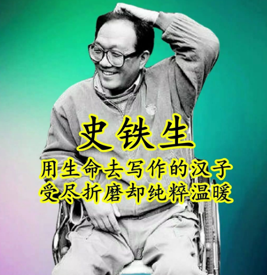

- 📖 书名：《我与地坛》
- 🧑‍ 作者：史铁生
- 🕒 阅读时间：2025-03-13 至 2025-03-22

《我与地坛》中的金句如繁星散落，每一句都凝聚着史铁生对生命的深刻洞察。以下是精选的15句，每句都堪称人生箴言：

### **关于生命与死亡**
1. **“死是一件不必急于求成的事，死是一个必然会降临的节日。”**  
   ——将死亡诗意化，消解恐惧，赋予其庄严的仪式感。

2. **“生命是磨难与幸运的统一。”**  
   ——道出生命的辩证本质，苦难与希望并存。

3. **“白昼是一种魔法，一种符咒，让僵死的规则畅行无阻，让实际消磨掉神奇。”**  
   ——批判世俗的僵化，呼唤黑夜般的自由与真实。

### **关于母爱与愧疚**
4. **“母亲在世的最后七年，我们总是对望，她眼里是我的影子，我眼里是她的容颜。”**  
   ——静默对望中，母爱无声流淌，愧疚与怀念交织。

5. **“她艰难的命运，坚忍的意志和毫不张扬的爱，随光阴流转。”**  
   ——三个定语递进，精准刻画中国母亲的隐忍与伟大。

### **关于命运与精神**
6. **“命运不是用来战胜的，而是用来相处的。”**  
   ——以哲学智慧重新定义“对抗命运”的命题。

7. **“视他人之疑目如盏盏鬼火，大胆地去走你的夜路。”**  
   ——面对质疑时，展现孤勇者的坚定与清醒。

8. **“残缺是生命的常态，而美，恰恰从残缺中生长。”**  
   ——重新定义残缺的价值，赋予苦难美学意义。

### **关于地坛与存在**
9. **“地坛的草木，宛如时间的守望者，记录着我每一次的挣扎与成长。”**  
   ——自然景物成为生命历程的见证者。

10. **“我在地坛的每一寸土地上都找到了自己的足迹，而这些足迹不仅仅是我的。”**  
    ——个体生命与历史、宇宙的共鸣。

### **关于希望与坚韧**
11. **“太阳，它每时每刻都是夕阳也都是旭日。”**  
    ——用自然现象隐喻生命的循环与永恒。

12. **“人生如此，生命亦然。无论遇见何等困境，请带着坚忍的意志，不屈的信心。”**  
    ——直抵人心的励志宣言。

### **文学性与哲理性并存**
13. **“所有的苦难不过是虚惊一场，而所有的虚惊都是命运对你的偏袒。”**  
    ——用悖论式表达消解苦难，赋予其积极意义。

14. **“历史在某一瞬间破碎，而心灵在破碎处眺望团圆。”**  
    ——将个人命运置于宏大历史中，寻找精神归宿。

15. **“地坛是虚化的母亲，母亲是心中的地坛。”**  
    ——情感与空间的互文，构建双重精神坐标。

这些金句如刀锋般锋利，又如春风般温暖，是史铁生留给世界的思想遗产。它们不仅照亮了个体的生命困境，也为人类共同的精神困境提供了答案。
